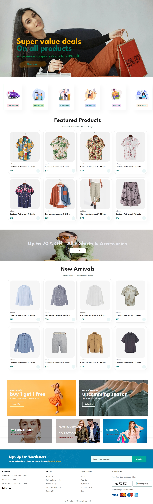
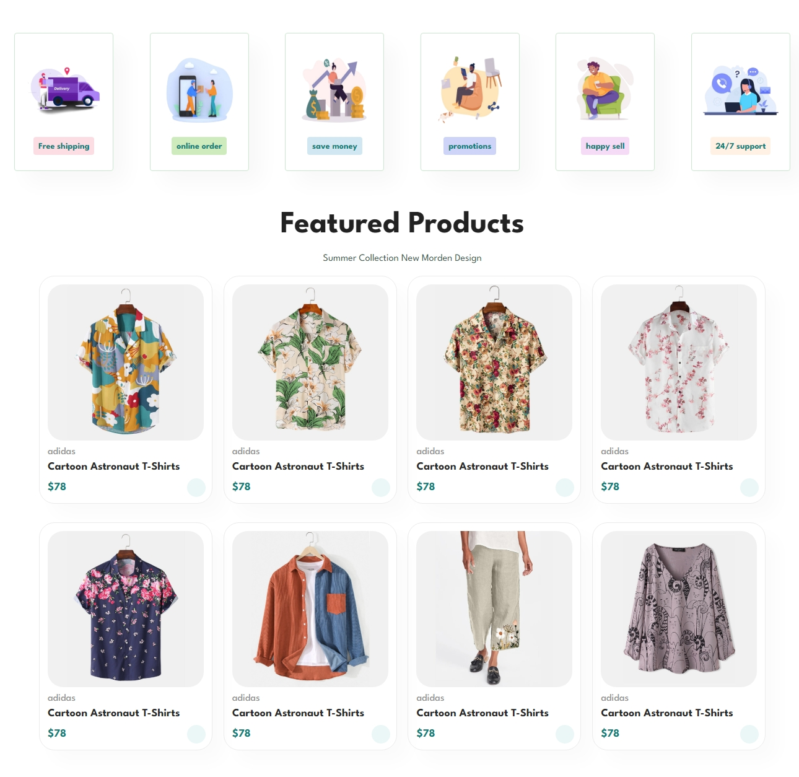
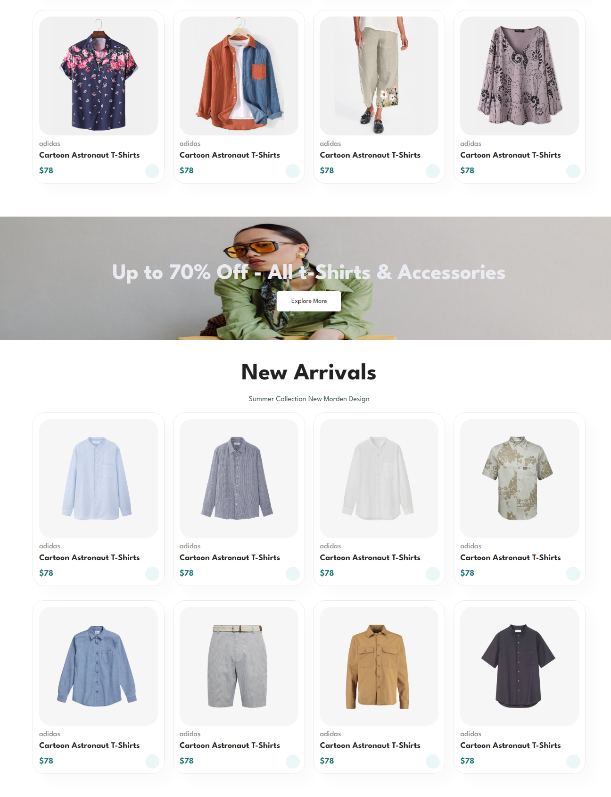

# ecommerce-platform
 A modern and fully responsive e-commerce platform built with the MERN stack (MongoDB, Express.js, React, Node.js). This project includes user authentication, product management, cart functionality, and secure payment integration.



# Green Bird Fashion Wear
 
 
 

## 🛍️ Project Overview
Green Bird Fashion Wear is an e-commerce website designed for online shopping. It features a modern UI with sections for featured products, promotions, and user interaction. The site includes a navigation menu, a dynamic product showcase, and an automatic image carousel.

## ⚠️ Project Status
🚧 **This project is still in production.**

- Future updates will include advanced features and optimizations.
- The final version will be built using the **MERN (MongoDB, Express, React, Node.js) stack**.
- Additional functionalities such as user authentication, payment gateway integration, and a personalized shopping experience will be added.

## 📂 Project Structure
```
/GreenBirdFashionWear
│── index.html       # Main HTML file
│── style.css        # CSS styles for UI
│── script.js        # JavaScript for interactivity
│── images/          # Images used in the project
│── fonts/           # Custom fonts (if any)
│── LICENSE          # License file
```

## 🌟 Features
- **Responsive Design**: Works on all screen sizes.
- **Automatic Image Carousel**: Smoothly cycles through images.
- **Navigation Menu**: Includes Home, Shop, Blog, About, and Contact pages.
- **Product Listings**: Displays featured and new arrival products.
- **Newsletter Subscription**: Allows users to sign up for updates.
- **Interactive UI Elements**: Animations, hover effects, and toggling menus.
- **Upcoming Features**: User authentication, secure payment integration, and database-driven inventory management.

## 🚀 Installation & Usage
1. **Download or Clone** the repository:
   ```sh
   git clone https://github.com/your-repo-name.git
   ```
2. **Open** `index.html` in a web browser.
3. Ensure all assets (CSS, JS, and images) are in the correct paths.

## 🛠️ Technologies Used
-  **HTML5** – Structure of the web pages.
-  **CSS3** – Styling and layout design.
-  **JavaScript (ES6)** – For interactive elements and event handling.
-  **MERN Stack** – Full-stack development (Coming Soon).
- **FontAwesome**: Icons for UI enhancements.
## Author
Developed with ❤️ by KISHAN SHARMA
linkedin : https://www.linkedin.com/in/kishanshr/

## 📌 How to Modify
- **CSS Styling**: Modify `style.css` to change colors, fonts, and layout.
- **JavaScript Logic**: Edit `script.js` to customize UI interactions.
- **Images & Content**: Replace the `images/` folder with your own assets.

## 📝 Notes
- Ensure all paths to images and external resources are correctly set.
- If using external libraries, check if they are loaded properly.

## 📜 License
This project is licensed under the [MIT License](LICENSE).

## 📧 Contact
For any queries, feel free to reach out via email or social media links provided on the website.

---

Enjoy shopping with **Green Bird Fashion Wear!** 🛒🎉


